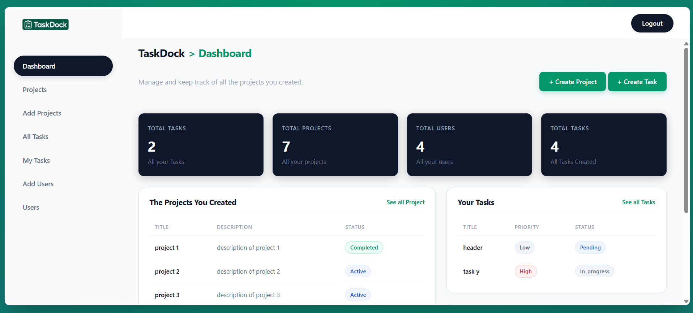

# TaskDock

TaskDock is a task and project management web application built with Laravel.

It allows administrators to manage users, projects, and tasks, while team members can view the projects they belong to and the tasks assigned to them.




## 📌 About The Project

I built TaskDock as a practical Laravel project to strengthen my backend and full-stack development skills.

The project focuses on authentication, role-based access control, CRUD operations, database relationships, task assignment, validation, and building a structured Laravel application from scratch.

## ✨ Features

### 🔐 Authentication

- User registration and login
- User logout
- Authentication using Laravel Breeze
- Protected routes using authentication middleware
- Password hashing
- Password confirmation
- Form validation

### 👥 Role-Based Access Control

TaskDock has two user roles:

**Admin**
- Create and manage users
- Create and manage projects
- Create and manage tasks
- Assign users to projects
- Unassign users from projects
- Assign tasks to team members
- Manage user roles

**User**
- View projects they belong to
- View their assigned tasks
- View task information
- Track their tasks and due dates

Admin-only pages and actions are protected using custom middleware.

### 📁 Project Management

- Create projects
- Edit projects
- Delete projects
- Manage project status
- View projects created by the admin
- View projects a user belongs to
- Assign team members to projects
- Unassign team members from projects

### ✅ Task Management

- Create tasks
- Edit tasks
- Delete tasks
- Assign tasks to users
- Leave tasks unassigned
- Set task priority
- Set task status
- Set due dates
- Track overdue tasks
- View all created tasks
- View personal tasks

### 📊 Dashboard

The dashboard changes depending on the user's role.

#### Admin Dashboard

- Total projects
- Total users
- Total tasks
- Recently created projects
- Recently created users
- Recently created tasks

#### User Dashboard

- Total personal tasks
- Projects the user belongs to
- Overdue tasks
- Personal task information

## 🗄️ Database Relationships

TaskDock uses Laravel Eloquent relationships to connect users, projects, and tasks.

### User & Projects

A user can create multiple projects.

A user can also belong to multiple projects as a team member.

This means there are two different relationships:

- **Project ownership:** a user owns/creates projects
- **Team membership:** a user can be a member of other projects

The team membership is handled through a many-to-many relationship and a `project_user` pivot table.

### User & Tasks

A user can have multiple tasks assigned to them.

Users can also create multiple tasks.

This allows the application to distinguish between:

- The user who created a task
- The user assigned to the task

### Project & Tasks

A project can contain multiple tasks.

Each task belongs to one project.

### Relationship Overview

```text
User
│
├── Creates → Projects
│
├── Belongs to → Projects (team members)
│
├── Creates → Tasks
│
└── Is assigned → Tasks
        │
        └── Belongs to → Project